# 00 计算机网络面试题
------
作者：守望者1028
链接：https://www.nowcoder.com/discuss/55353
来源：牛客网

2计算机网络（TCP/IP）
## 1 建立TCP服务器的各个系统调用

## 2 继上一题，说明socket网络编程有哪些系统调用？其中close是一次就能直接关闭的吗，半关闭状态是怎么产生的？

## 3 对路由协议的了解与介绍。内部网关协议IGP包括RIP，OSPF，和外部网关协议EGP BGP.
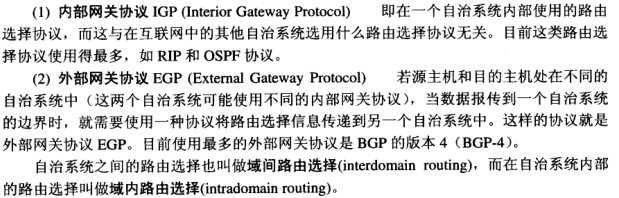  

+ RIP (Routing Information Protocol) 基于距离向量的路由选择协议
    每过一个路由器，距离（也叫跳数）加1，最多支持15个，当等于16就表示不可达。
    特点：
        1 仅和相邻的路由交换信息  
        2 交换的是路由表  
        3 按固定时间交换路由信息 （路由器收到路由信息，或者拓扑结构变化时，更新表）  
        4 下层使用UDP 520  
        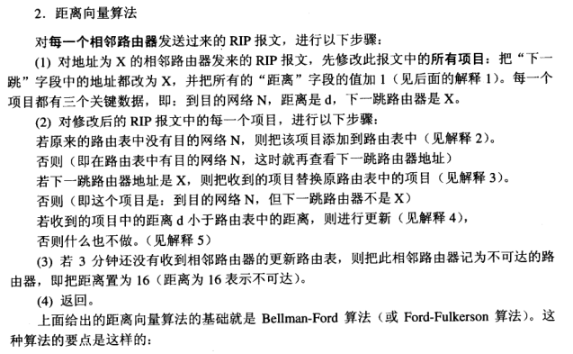  
    缺点：  
        1 限制网络规模  
        2 规模越大开销越大  
        3 坏消息传播得慢  

+ OSPF （open shortest path first）开放最短路径优先  
    特点：  
        1 使用分布式的链路状态协议  
        2 向本自治系统中所有路由器发送消息。给相邻的发，相邻又给其相邻的发，整个网络都发到。  
        3 发送的信息是与本路由器相邻的所有路由器的链路状态  
        4 只有当链路状态发生变化时，才会通过此法更新。  
        5 直接使用IP 协议段是89  

+ BGP 边界网关协议 （BGP-4）  
    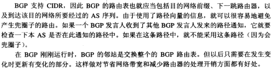  

## 4 路由协议所使用的算法。

## 5 TCP和UDP的区别  
1、TCP面向连接（如打电话要先拨号建立连接）;UDP是无连接的，即发送数据之前不需要建立连接  
2、TCP提供可靠的服务。也就是说，通过TCP连接传送的数据，无差错，不丢失，不重复，且按序到达;UDP尽最大努力交付，即不保证可靠交付。Tcp通过校验和，重传控制，序号标识，滑动窗口、确认应答实现可靠传输。如丢包时的重发控制，还可以对次序乱掉的分包进行顺序控制。    
3、UDP具有较好的实时性，工作效率比TCP高，适用于对高速传输和实时性有较高的通信或广播通信。  
4.每一条TCP连接只能是点到点的;UDP支持一对一，一对多，多对一和多对多的交互通信  
5、TCP对系统资源要求较多，UDP对系统资源要求较少。  

## 6 TCP和UDP相关的协议与端口号
TCP对应的协议：
+ FTP：定义了文件传输协议，使用21端口。
+ Telnet：一种用于远程登陆的端口，使用23端口，用户可以以自己的身份远程连接到计算机上，可提供基于DOS模式下的通信服务。
+ SMTP：邮件传送协议，用于发送邮件。服务器开放的是25号端口。
+ POP3：它是和SMTP对应，POP3用于接收邮件。POP3协议所用的是110端口。
+ HTTP：是从Web服务器传输超文本到本地浏览器的传送协议。

UDP对应的协议：
+ DNS：用于域名解析服务，将域名地址转换为IP地址。DNS用的是53号端口。
+ SNMP：简单网络管理协议，使用161号端口，是用来管理网络设备的。由于网络设备很多，无连接的服务就体现出其优势。
+ TFTP(Trival File Tran敏感词er Protocal)，简单文件传输协议，该协议在熟知端口69上使用UDP服务。

> DNS域名系统，它的工作原理是：
当DNS客户机需要在程序中使用名称时，它会查询DNS服务器来解析该名称。客户机发送的每条查询信息包括三条信息：包括：指定的DNS域名，指定的查询类型，DNS域名的指定类别。基于UDP服务，端口53. 该应用一般不直接为用户使用，而是为其他应用服务，如HTTP，SMTP等在其中需要完成主机名到IP地址的转换。

>一些常见的端口号及其用途如下：
TCP 21端口：FTP 文件传输服务
TCP 23端口：TELNET 终端仿真服务
TCP 25端口：SMTP 简单邮件传输服务
TCP 80端口：HTTP 超文本传输服务
TCP 110端口：POP3 “邮局协议版本3”使用的端口
TCP 443端口：HTTPS 加密的超文本传输服务
TCP 1521端口：Oracle数据库服务
TCP 1863端口：MSN Messenger的文件传输功能所使用的端口
TCP 3389端口：Microsoft RDP 微软远程桌面使用的端口
TCP 5631端口：Symantec pcAnywhere 远程控制数据传输时使用的端口
TCP 5000端口：MS SQL Server使用的端口
UDP 53端口：DNS 域名解析服务
UDP 5632端口：Symantec pcAnywhere 主控端扫描被控端时使用的端口
UDP 8000端口：腾讯QQ

## 7 TCP（UDP，IP）等首部的认识（http请求报文构成）
+ IP
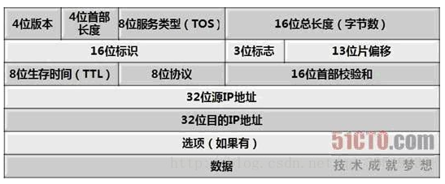

+ TCP
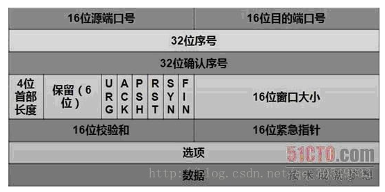

+ UDP
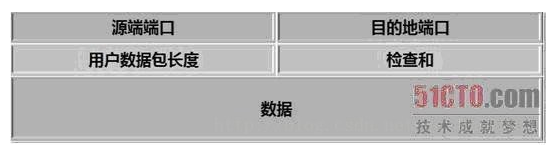

## 8 网页解析的过程与实现方法(在浏览器中输入URL后执行的全部过程（如www.baidu.com）)
[网页解析的全过程(输入url到展示页面) - 天然呆☆☆ - 博客园](https://www.cnblogs.com/wpshan/p/6282061.html)
    
## 9 网络层分片的原因与具体实现
原因：由于不同网路的数据链路层容许的MTU（最大的传输字节长度不一样）对于过长的IP包 就必须进行分片处理。
实现：路径MTU发现 算法：发送一个不允许分片的MTU包。到达超过了的路由器时，就会丢掉，并返回一个icmp的不可达消息将数据链路上的MTU的值发送给主机，下次就按此MTU发，一直到目的IP主机。这样就可以找到最小的MTU，以此来分片。

## 10 TCP的三次握手与四次挥手的详细介绍（TCP连接建立与断开是热门问题）
三次握手：  

四次挥手：  
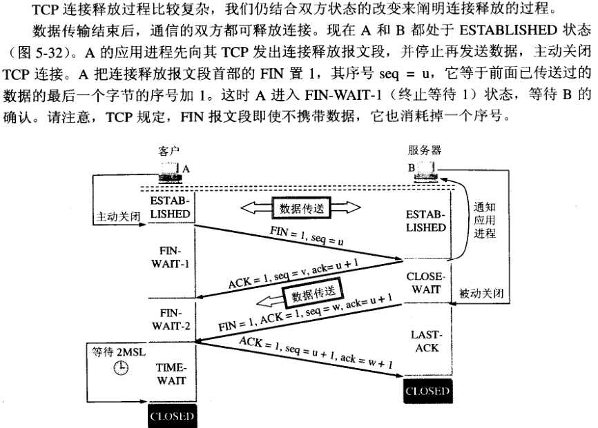

## 11 TCP握手以及每一次握手客户端和服务器端处于哪个状态（11种状态）

> 1)、LISTEN:首先服务端需要打开一个socket进行监听，状态为LISTEN.  The socket is listening for incoming connections. 侦听来自远方TCP端口的连接请求   
> 2)、SYN_SENT:客户端通过应用程序调用connect进行active open.于是客户端tcp发送一个SYN以请求建立一个连接.之后状态置为SYN_SENT. The socket is actively attempting to establish a connection. 在发送连接请求后等待匹配的连接请求   
> 3)、SYN_RECV:服务端应发出ACK确认客户端的SYN,同时自己向客户端发送一个SYN. 之后状态置为SYN_RECV 。 A connection request has been received from the network. 在收到和发送一个连接请求后等待对连接请求的确认  
> 4)、ESTABLISHED: 代表一个打开的连接，双方可以进行或已经在数据交互了。The socket has an established connection. 代表一个打开的连接，数据可以传送给用户  
> 5)、FIN_WAIT1:主动关闭(active close)端应用程序调用close，于是其TCP发出FIN请求主动关闭连接，之后进入FIN_WAIT1状态。 The socket is closed, and the connection is shutting down. 等待远程TCP的连接中断请求，或先前的连接中断请求的确认  
> 6)、CLOSE_WAIT:被动关闭(passive close)端TCP接到FIN后，就发出ACK以回应FIN请求(它的接收也作为文件结束符传递给上层应用程序),并进入CLOSE_WAIT。The remote end has shut down, waiting for the socket to close. 等待从本地用户发来的连接中断请求  
> 7)、FIN_WAIT2:主动关闭端接到ACK后，就进入了FIN-WAIT-2 。 Connection is closed, and the socket is waiting for a shutdown from the remote end. 从远程TCP等待连接中断请求   
> 8)、LAST_ACK:被动关闭端一段时间后，接收到文件结束符的应用程序将调用CLOSE关闭连接。这导致它的TCP也发送一个 FIN,等待对方的ACK.就进入了LAST-ACK 。 The remote end has shut down, and the socket is closed. Waiting for acknowledgement. 等待原来发向远程TCP的连接中断请求的确认  
> 9)、TIME_WAIT:在主动关闭端接收到FIN后，TCP就发送ACK包，并进入TIME-WAIT状态。 The socket is waiting after close to handle packets still in the network.等待足够的时间以确保远程TCP接收到连接中断请求的确认   
> 10)、CLOSING: 比较少见。Both sockets are shut down but we still don’t have all our data sent. 等待远程TCP对连接中断的确认   
> 11)、CLOSED: 被动关闭端在接受到ACK包后，就进入了closed的状态。连接结束。 The socket is not being used. 没有任何连接状态   
> TIME_WAIT状态的形成只发生在主动关闭连接的一方。  
> 主动关闭方在接收到被动关闭方的FIN请求后，发送成功给对方一个ACK后,将自己的状态由FIN_WAIT2修改为 TIME_WAIT，而必须再等2倍 的MSL(Maximum Segment Lifetime,MSL是一个数据报在internetwork中能存在的时间)时间之后双方才能把状态 都改为CLOSED以关闭连接。目前RHEL里保持TIME_WAIT状态的时间为60秒。  

## 12 为什么使用三次握手，两次握手可不可以？
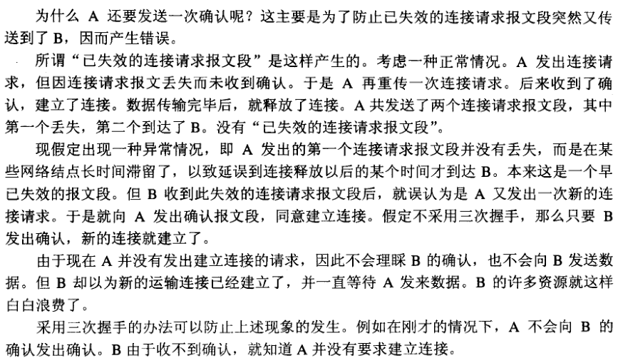

为了防止已失效的连接请求报文段突然又传到了B，因而产生错误。

## 13 TIME_WAIT的意义（为什么要等于2MSL）
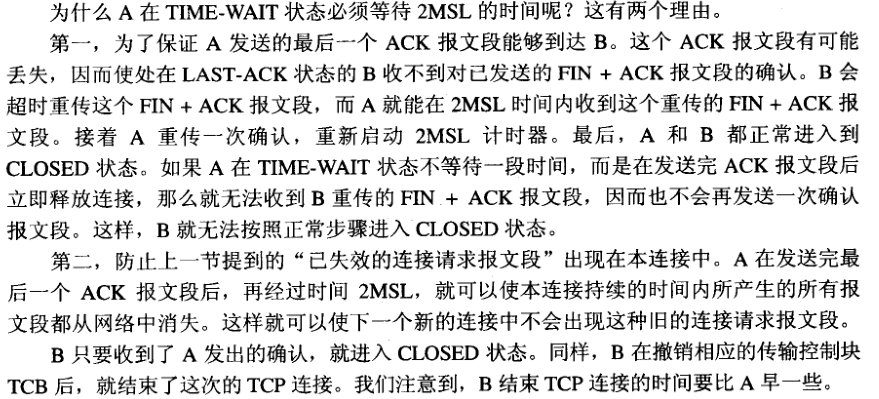

1. 为了防止A发送的ack，B没有收到，导致b重新发送的fin+ack，A收不到导致B无法正常关闭。
2. 防止了已失效的连接请求报文段突然又传到了B

## 14 超时重传机制（不太高频）
发送报文后，在特定的时间rtt内没有收到ack，就会重发。
RTT的选择：每次记录一个报文来回的时间，（1-a）rtt1 + a* rtt2。

## 15 TCP怎么保证可靠性（面向字节流滑动窗口，超时重传，应答机制，拥塞控制，校验等）？

## 16 流量控制的介绍，采用滑动窗口会有什么问题（死锁可能，糊涂窗口综合征）？
流量控制：发送方通过接收方提供的接收窗口的大小，来控制发送窗口的大小。
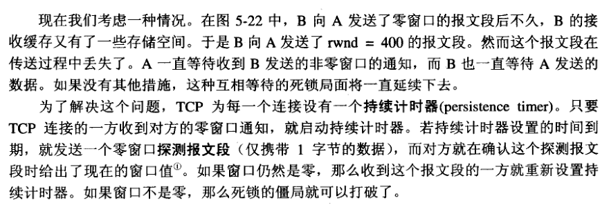  
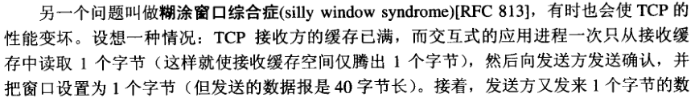  
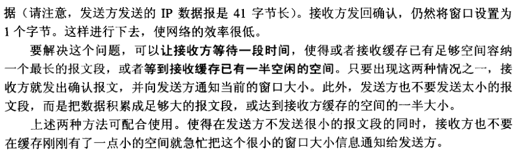  

## 17 tcp滑动窗口协议

## 18 TCP拥塞控制，算法名字？（极其重要）  
控制一个拥塞窗口，
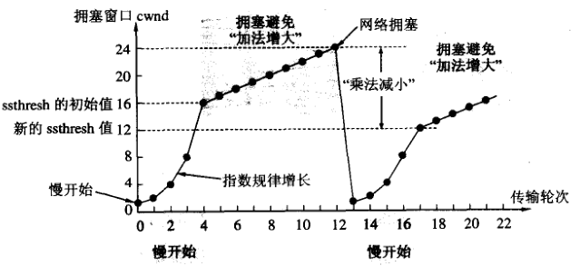  

设置一个慢开始门限ssthresh， 开始的是时候拥塞窗口cwnd=1，每次两倍的增大cwnd。
当超过ssthresh时，改用拥塞避免算法，每次cwnd+1。
当遇到拥塞时，ssthresh = cwnd/2， cwnd = 1。

快重传和快恢复
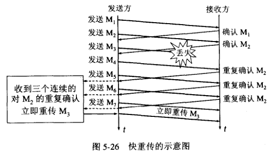  
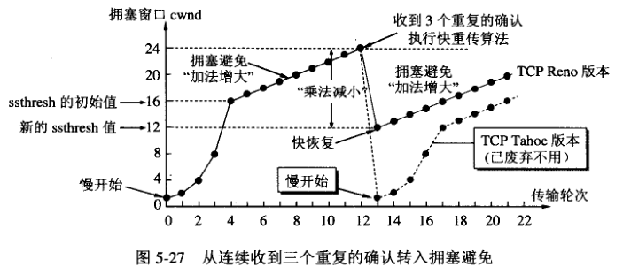  

当接收方收到一个无序的包时，就重复确认之前的包，当发送方收到3个重复确认的（加之前的一个就是4个），就认为网络可能拥塞了，就开始**快重传**，马上重发没有ack的包。
同时开始**快恢复**，将ssthresh = cwnd/2, cwnd = cwnd/2,再使用拥塞避免算法，cwnd每次加1。

## 19 拥塞控制和流量控制的区别

## 20 http协议与TCP联系

## 21 http/1.0和http/1.1的区别
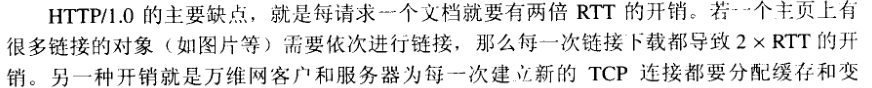  
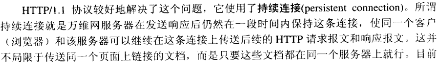  
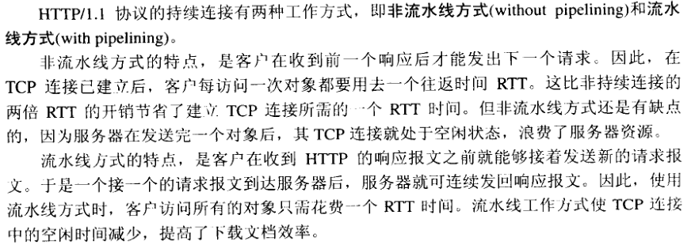  

http 1.0 每次获取数据都有建立tcp连接，在第三次握手后，获得数据，然后就断开了，时间：2rtt
http 1.1 建立一次连接可以获取多次数据，每次获取数据的时间，1rtt
    非流水线方式：每获取一次，都要等到获取到，才能进行下一次获取。1rtt只能获取到一次数据
    流水线方式：不用等获取到数据，就可以继续发请求，1rtt可以获取到多个数据

## 22 http的请求方法有哪些？get和post的区别。
## 23 http的状态码
## 24 http和https的区别，由http升级为https需要做哪些操作
## 25 https的具体实现，怎么确保安全性
## 26 http中浏览器一个URL的流程，这个过程中浏览器做了什么，URL包括哪三个部分？
（28） 一个机器能够使用的端口号上限是多少，为什么？可以改变吗？那如果想要用的端口超过这个限制怎么办？
（29） 对称密码和非对称密码体系
（30） 数字证书的了解（高频）
（31） 客户端为什么信任第三方证书
（32） RSA加密算法，MD5原理（MD5不算加密算法）
（33） 单条记录高并发访问的优化
（34） 介绍一下ping的过程，分别用到了哪些协议
（36） 有没有抓过TCP包，描述一下
（37） 一个ip配置多个域名，靠什么识别？
（38） 服务器攻击（DDos攻击）
